# Tutorial: Using PowerShell to Deploy Equinix Metal Devices


## Introduction


This tutorial is for you if you do have a Windows laptop and want to get started deploying a server using the Metal CLI. Or maybe you don’t have a Windows laptop but want to interact with Equinix Metal on Windows - that works too.

We’ll learn how to install an Equinix Windows binary, SSH into a bare metal server, and take a look at `console.equinix.com`.

When this tutorial is done we’ll have a server config like this:


|   City   | Operating System | Server Specification |
| -------- | ---------------- | -------------------- |
| New York |   Ubuntu 24.04   |     c3.small.x86     |


Let’s get started.


### Equinix Console


The easiest and fastest way to deploy a bare metal server on Equinix Metal on any device is at console.equinix.com. Here’s a quick tutorial for that (https://deploy.equinix.com/developers/guides/deploy-first-server)


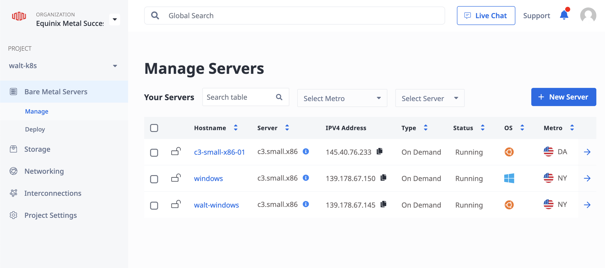


After you choose a metro, configuration, and operating system then your server is up and running. But the console is limited to a few commands like overview information, rebooting the server, or deleting the server. Since it’s not as powerful as using the CLI, then let’s do that right now.


### Equinix CLI


Spend a few minutes to get familiar with the Metal CLI Reference (https://deploy.equinix.com/developers/docs/metal/libraries/cli/). We’ll be using those commands soon, but first let’s download the Windows Binary so that our computer will understand the Metal commands that we’ll soon tell it to do.


### Installing the Equinix Metal Binary on Windows


Download the resource at https://github.com/equinix/metal-cli/releases

Click on Show all 17 assets

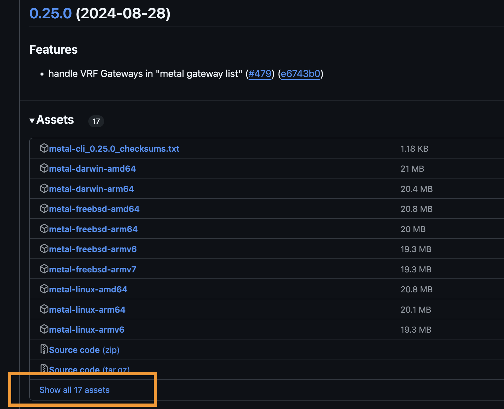

Download the windows reference, AMD64.exe

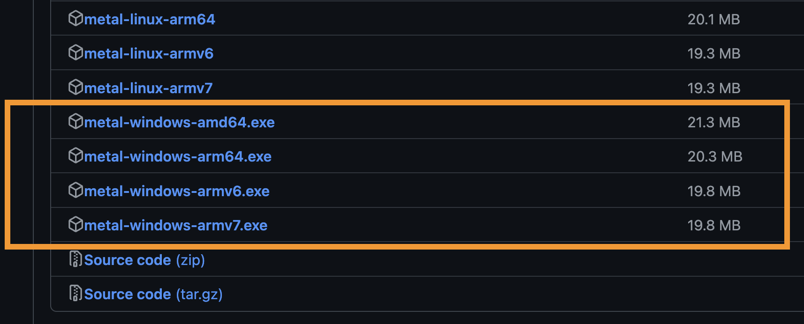


You might have to “Show more > Keep anyway” before downloading

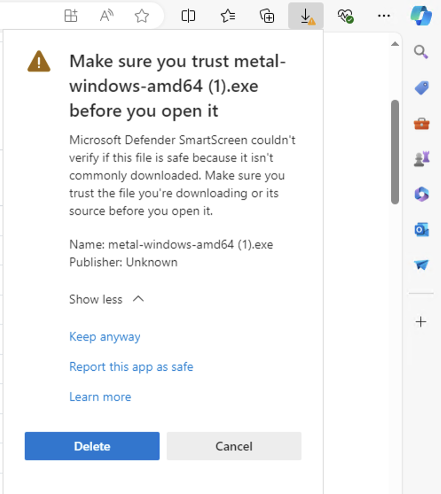

Place the downloaded file onto the desktop for easy access

Our path is now ~\Desktop\metal-windows-amd64.exe

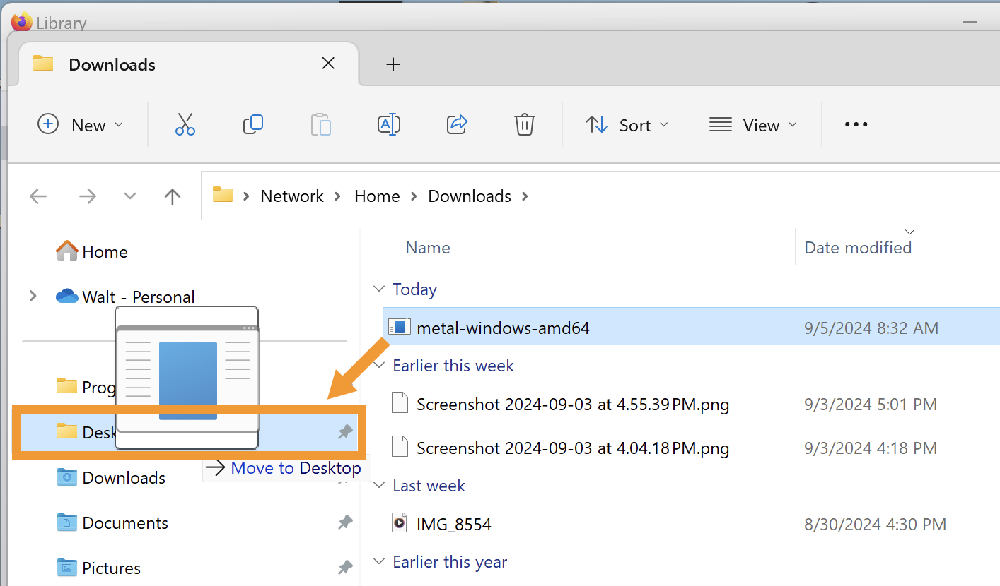

Rename the file from metal-windows-amd64.exe to metal.exe

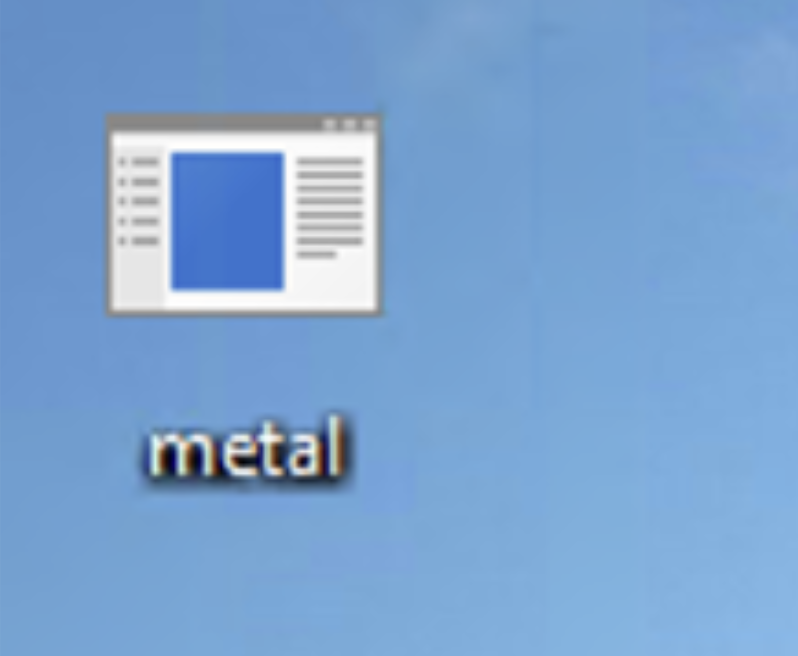

Click on the Start menu – there are 2 options for a command line tool:

PowerShell

cmd

You could type either one for this tutorial, but we’ll use PowerShell and then launch that application.

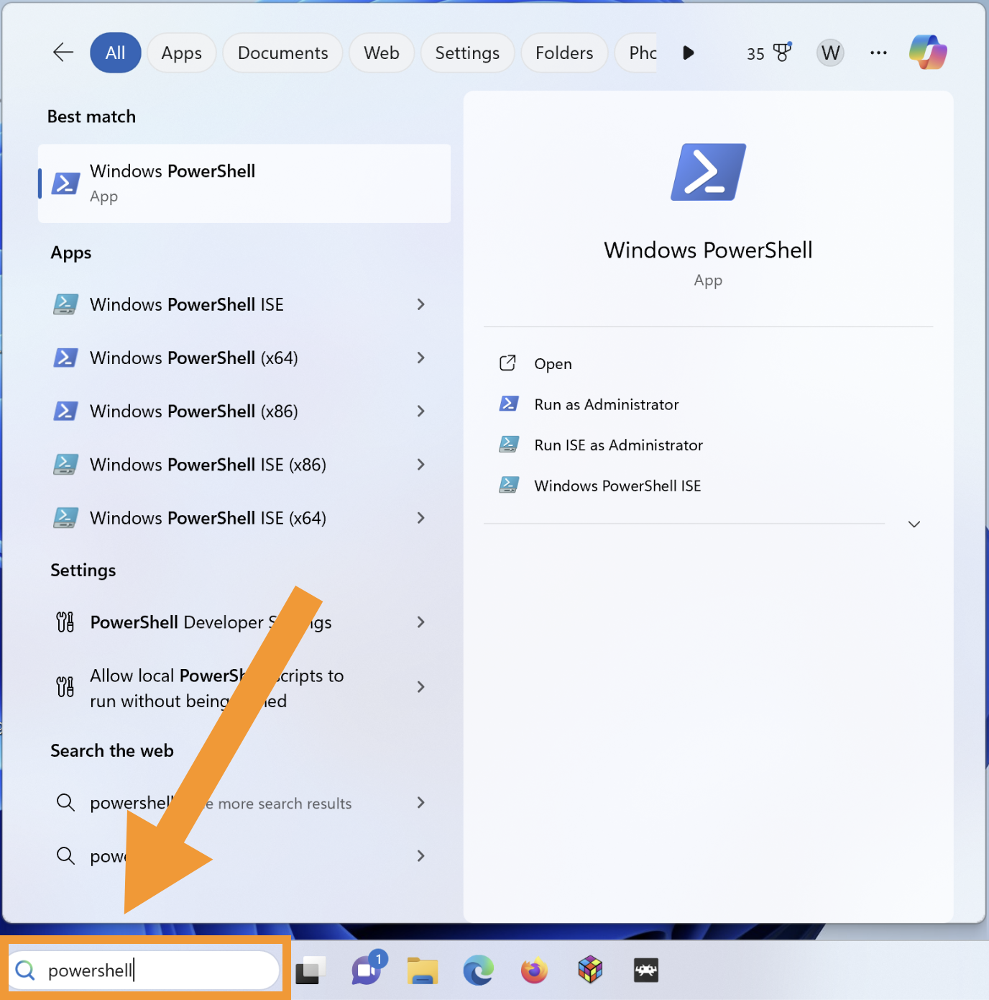

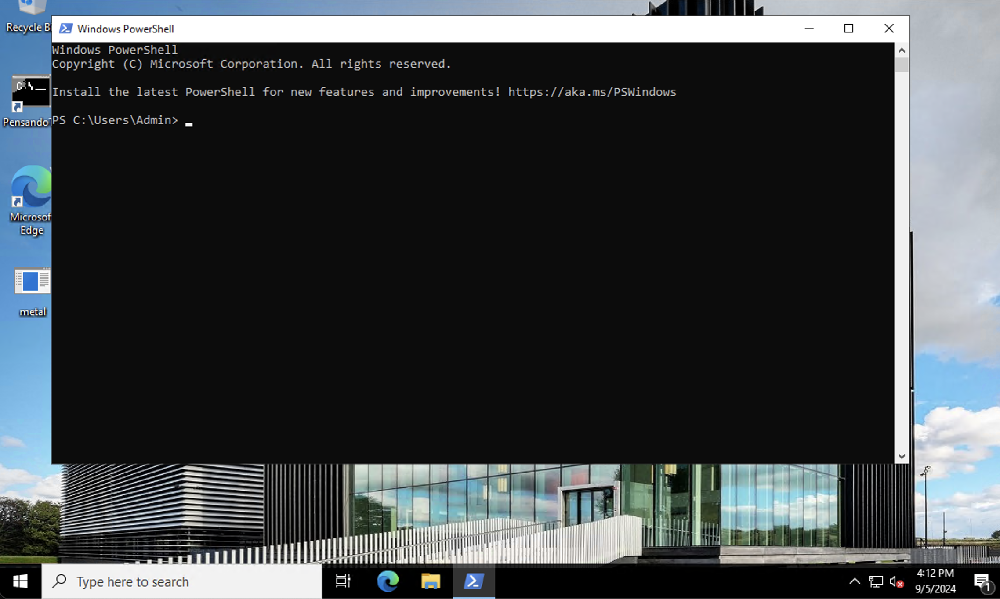


ICACLS the file permissions (similar to CHMOD)

There are 2 ways to change the file permissions:

The 1st way is to Right click on the file > Properties > Security  > Edit

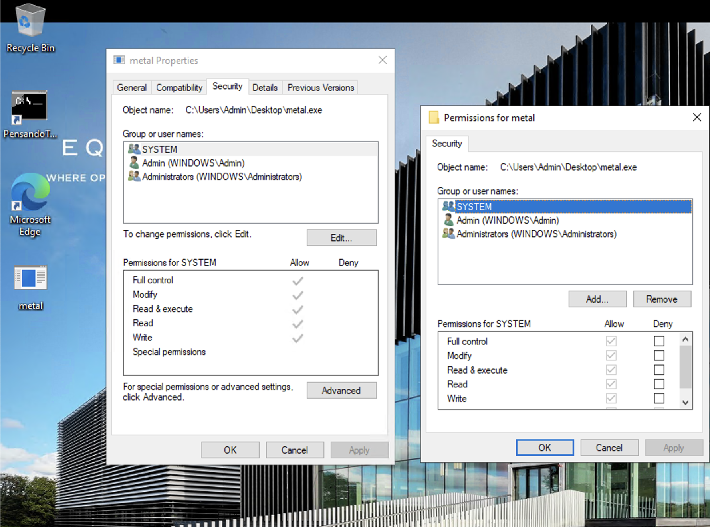

Unable to load the picture

According to “Right click on the file > Properties > Security  > Edit” the file already has RWX permission. In that case I can skip to the #metal-init section below.

If the binary doesn’t have execute privileges then allow 'Full Control’ and press ‘OK’.

- If you prefer to change permission using PowerShell, then drag-and-drop the file into the PowerShell window. There you’ll easily get the $PATH, in this case it’s C:\Users\Admin\Desktop\metal.exe

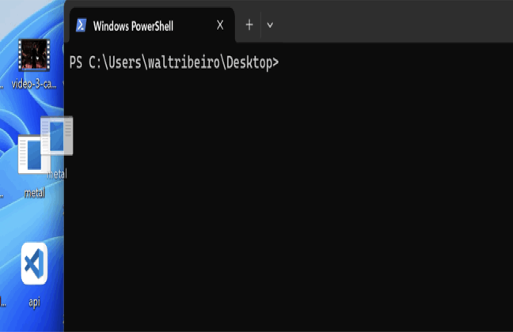

Unable to load the picture

And then let’s CD into the metal.exe’s parent directory

`$ CD C:\Users\<USER>\Desktop\ `

Then run command icacls "metal.exe" which will give it execution permissions. Now onto the next step.


### Metal Init


Now the metal.exe is ready to be initialized. Run this command:

$ start metal

$ command ./metal init

You should see a prompt:

```
Equinix Metal API Tokens can be obtained through the portal at https://console.equinix.com/profile/api-keys

See https://deploy.equinix.com/developers/docs/metal/identity-access-management/users/ for more details.

User Token (hidden):
```

The CMD is asking for the API token. So go to https://console.equinix.com/profile/api-keys to create one, copy that string, and then paste it into the User Token (hidden) prompt above.

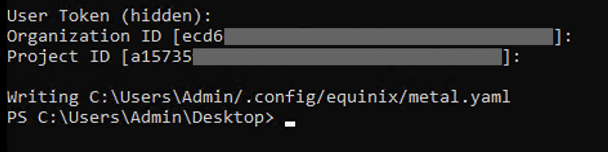


Run command:

$ export METAL_AUTH_TOKEN=<your_API_TOKEN>

Similar to our Authentication Readme (https://deploy.equinix.com/developers/docs/metal/libraries/cli/#authentication)

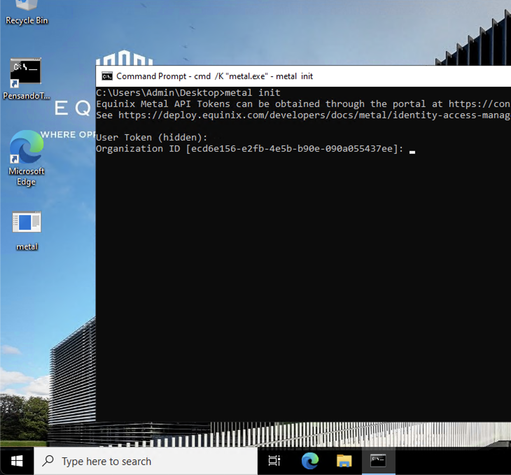


Great – now we have the Metal CLI installed. Run this command to make sure it’s working:

$ metal man


### Deploy our first server


Now that Metal CLI is installed, let’s use it to deploy a server using this boilerplate syntax:


$ metal device create -p <project_id> (-m <metro> | -f <facility>) -P <plan> -H <hostname> -O <operating_system>


Here’s what I’ll send:


$ metal device create -p a15735f1-ded8-4c10-8dc1-330d6f159732 -m ny -P c3.small.x86 -H walt-windows -0 ubuntu_24_04


This will deploy an Equinix Metal server in New York City with a c3.small.x86 config running Ubuntu 24.04. Use the Metal CLI Reference to become familiar with the flags and syntax.

The readout should look like this, confirming that the server is now spinning up along with the ID, hostname, and more.

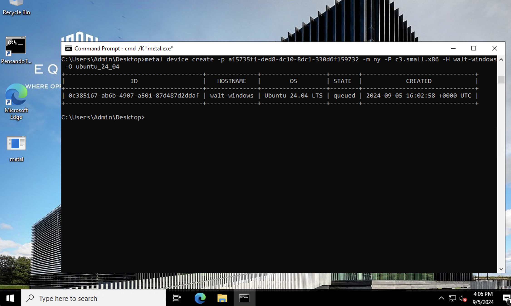


Congrats! You just deployed a full bare metal server in New York City using the Equinix Metal CLI.

Check out the Equinix Metal CLI Reference to launch your own configurations – be sure to use the coupon code.


### SSH into the Server


Now let’s access our server from the Windows laptop.


$ ssh root@147.75.193.171

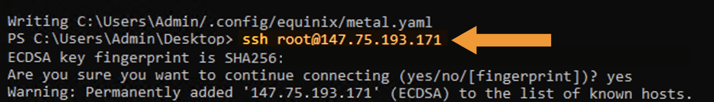


> [!NOTE]
> If you need an SSH key for the Windows laptop then use this tutorial:


https://deploy.equinix.com/developers/docs/metal/identity-access-management/ssh-keys/


You may have to VIM into the id_ed25519.pub file and edit it manually.

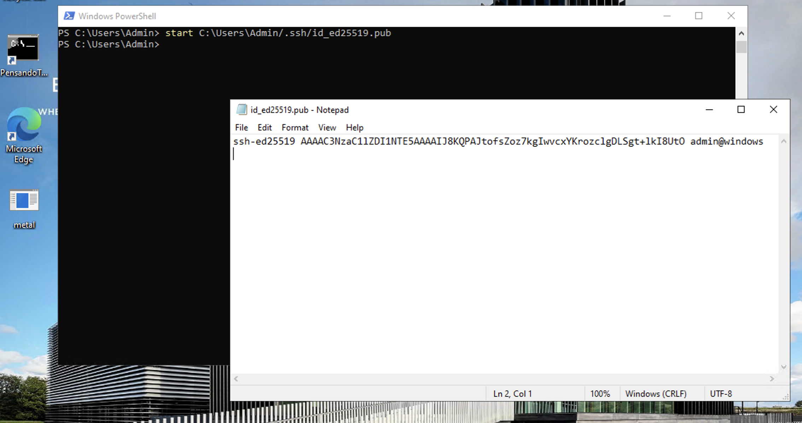

Congrats – we now have:

|   City   | Operating System | Server Specification |
| -------- | ---------------- | -------------------- |
| New York |   Ubuntu 24.04   |     c3.small.x86     |


At this point, you can do anything. If you want to install a Kubernetes workload cluster with K3s then we have a Doc for that. 